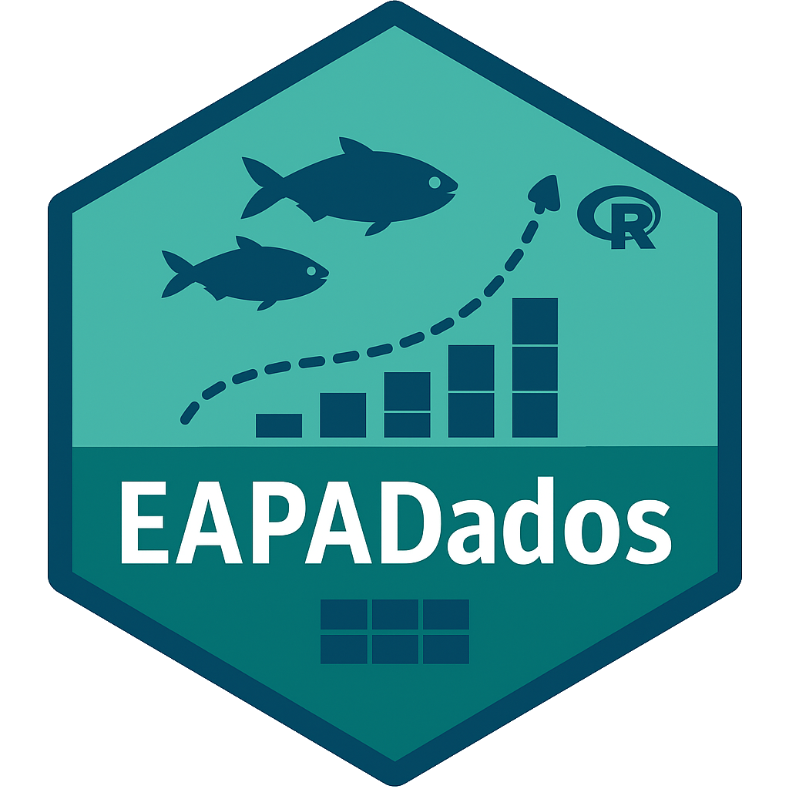

<!-- README.md is generated from README.Rmd. Please edit that file -->

```{r, include = FALSE}
knitr::opts_chunk$set(
  collapse = TRUE,
  comment = "#>",
  fig.path = "man/figures/README-",
  out.width = "100%"
)
```

# EAPADados

<!-- badges: start -->

<!-- badges: end -->

+:--------------------------------------------------:+:-----------------------------------------------------------------------------------------------------------------------------------------------------------------------------------------------------------------+
|  | **EAPADados** disponibiliza conjuntos de dados didáticos para **Estatística Aplicada à Pesca e Aquicultura** com R. Cada dataset tem help e exemplos em R, perfeito para aulas, relatórios e análise científica. |
|                                                    |                                                                                                                                                                                                                  |
|                                                    | yyuuuuuuuuuuuuuuuuuuuuuuuuuuuuuuuuuuuuuuuuuuu                                                                                                                                                                    |
+----------------------------------------------------+------------------------------------------------------------------------------------------------------------------------------------------------------------------------------------------------------------------+

\|

## Instalação

```{r instalacao, eval=FALSE}

# No console R (substitua pela URL correta):
install.packages("https://github.com/astuciasnor/EAPADados/releases/download/v0.1.1/EAPADados_0.1.1.zip",
                 repos = NULL,
                 type = "win.binary")

library(EAPADados)
head(tilapia_crescimento)
```

## Exemplo de Uso

This is a basic example which shows you how to solve a common problem:

```{r example, eval=FALSE}
library(EAPADados)
## basic example code
```
