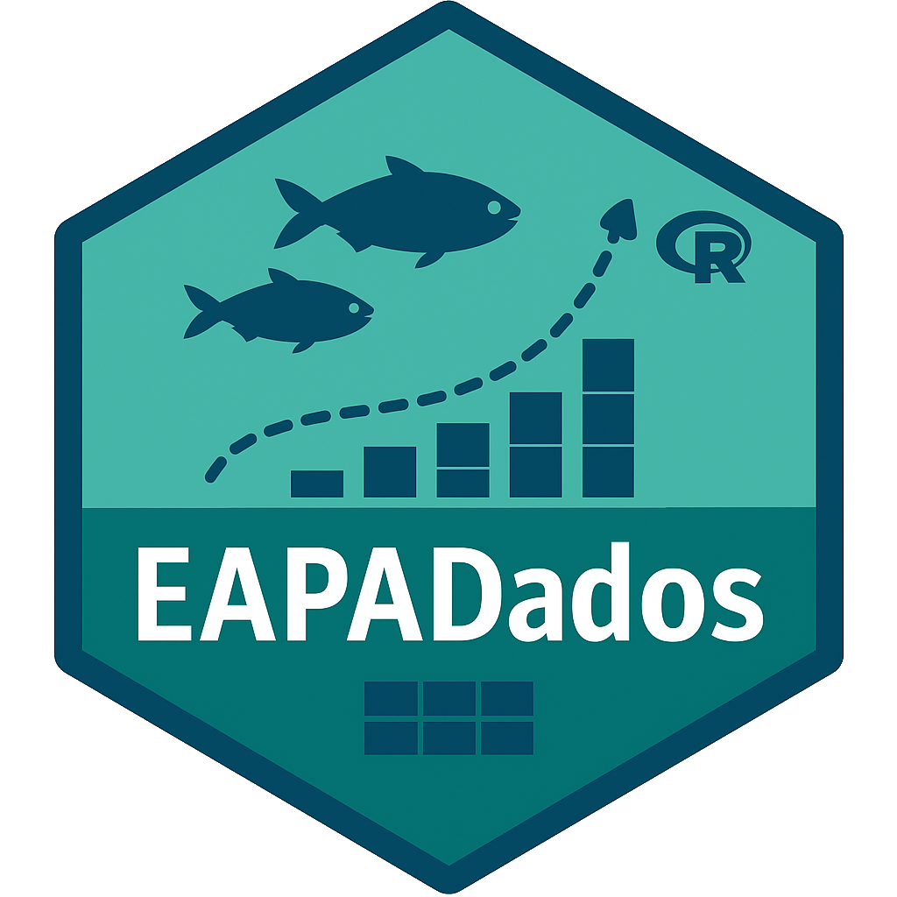

<!-- README.md is generated from README.Rmd. Please edit that file -->

# EAPADados

<!-- badges: start -->

<!-- badges: end -->

<table>
<colgroup>
<col style="width: 20%" />
<col style="width: 79%" />
</colgroup>
<tbody>
<tr>
<td
style="text-align: center;"></td>
<td style="text-align: left;"><p><strong>EAPADados</strong>
disponibiliza conjuntos de dados didáticos para <strong>Estatística
Aplicada à Pesca e Aquicultura</strong> com R. Cada dataset tem help e
exemplos em R, perfeito para aulas, relatórios e análise científica.</p>
<p>yyuuuuuuuuuuuuuuuuuuuuuuuuuuuuuuuuuuuuuuuuuuu</p></td>
</tr>
</tbody>
</table>

\|

## Instalação

``` r

# No console R (substitua pela URL correta):
install.packages("https://github.com/astuciasnor/EAPADados/releases/download/v0.1.1/EAPADados_0.1.1.zip",
                 repos = NULL,
                 type = "win.binary")

library(EAPADados)
head(tilapia_crescimento)
```

## Exemplo de Uso

This is a basic example which shows you how to solve a common problem:

``` r
library(EAPADados)
## basic example code
```
